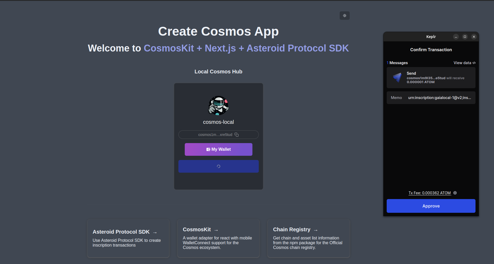

This is a Asteroid Cosmos App example to show how to integrate [@asteroid-protocol/sdk](https://npmjs.com/package/@asteroid-protocol/sdk) with Next.js and CosmosKit, bootstrapped with [`create-cosmos-app`](https://github.com/cosmology-tech/create-cosmos-app).

## Getting Started

First, install the packages and run the development server:

```bash
yarn && yarn dev
```


